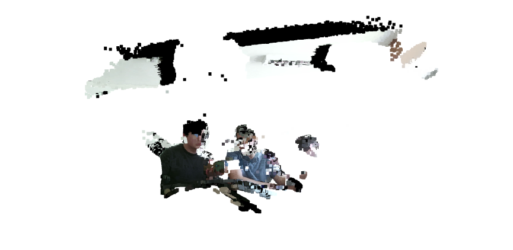
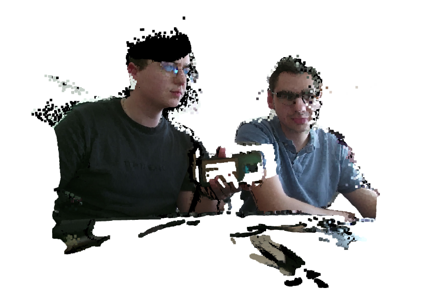
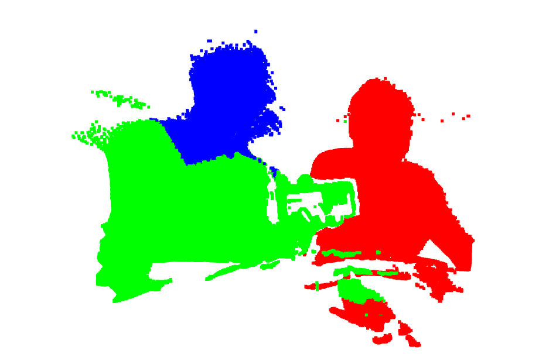
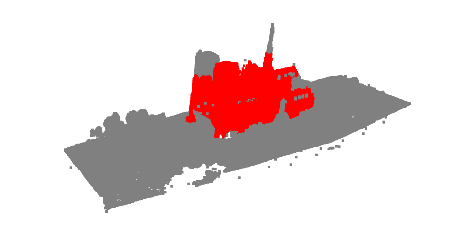

# Klasifikácia bodového mraku pomocou BIRCH alebo K-means

Tento Python skript načíta 3D bodový mrak zo súboru `.ply` alebo `.pcd`, vyhľadá a odstráni najväčšiu rovinu (napr. zem, stenu) a zvyšné body rozdelí do klastrov pomocou jedného z dvoch algoritmov: **BIRCH** alebo **K-means**. Výsledné klastre sú vizualizované rôznymi farbami.

## Čo skript robí

1. **Načíta bodový mrak** zo súboru.
2. **Segmentuje najväčšiu rovinu** pomocou RANSAC algoritmu.
3. **Oddelí zvyšné body** (outliery) od roviny.
4. **Odstráni NaN hodnoty** z dát.
5. **Klastruje outliery** pomocou vybraného algoritmu (BIRCH alebo K-means).
6. **Vizualizuje výsledok** v 3D okne.

---

## BIRCH

1. **`Birch(n_clusters=3, threshold=0.07, branching_factor=100):`**  
   Tento riadok vytvorí inštanciu triedy `Birch` z knižnice `sklearn.cluster` a určuje, že chceme rozdeliť dáta do 3 klastrov.

   - `n_clusters=3`: Určuje počet klastrov, ktoré má algoritmus BIRCH nájsť (3 klastry vo vašom prípade).

   **Parametre:**
   - **`n_clusters=k:`**  
     Tento parameter určuje počet klastrov, ktoré algoritmus BIRCH má nájsť po vykonaní zoskupovania.  
     - `k`: Môže to byť akákoľvek hodnota, ktorá určuje požadovaný počet klastrov. Ak je hodnota `n_clusters=k`, algoritmus sa pokúsi rozdeliť dáta na `k` klastrov.  
     - Ak je `n_clusters` nastavené na `None`, algoritmus bude pokračovať v procesoch zoskupovania, až kým sa počet klastrov nestabilizuje podľa iných parametrov.

   - **`threshold=0.07:`**  
     `threshold` určuje maximálnu vzdialenosť, akú môže mať bod od centrálnej hodnoty mikroklastra (Centroidu) predtým, než bude priradený k novému mikroklastru.  
     - Tento parameter riadi, ako „tesne“ sa budú mikroklastre držať pohromade.  
     - Nižšia hodnota znamená prísnejšie kritériá na to, aby sa bod priradil k existujúcemu mikroklastru, čo môže viesť k väčšiemu počtu mikroklastrov.  
     - Vyššia hodnota znamená, že bod môže byť priradený k širšiemu rozsahu mikroklastrov, čím sa zníži počet mikroklastrov, ale môže to spôsobiť, že sa niektoré klastre budú miešať.

   - **`branching_factor=100:`**  
     `branching_factor` určuje maximálny počet podstromov, ktoré môže obsahovať každý uzol v CF Tree (Cluster Feature Tree), ktorý BIRCH používa na reprezentáciu klastrov.  
     - Vyššia hodnota umožňuje väčšie podstromy, čím sa znižuje počet uzlov a zjednodušuje hierarchia stromu.  
     - Nižšia hodnota spôsobí, že strom bude mať viac úrovní a uzlov, čo môže spomaliť výpočty, ale zvýši flexibilitu v spracovaní dát.

2. **`.fit(outlier_points):`**  
   Metóda `.fit()` aplikuje algoritmus BIRCH na naše dáta (`outlier_points`).

   - **Ako funguje algoritmus BIRCH:**
     - **Mikroklastre (Microclusters):** Algoritmus začína tým, že rozdelí dáta na malé mikroklastre. Každý mikroklaster je reprezentovaný centroidom a ďalšími štatistikami ako priemer a rozptyl.
     - **CF Tree (Cluster Feature Tree):** Potom vytvorí hierarchickú štruktúru známa ako CF Tree, ktorá efektívne uchováva informácie o mikroklastroch.
     - **Zoskupovanie:** Algoritmus postupne priraďuje mikroklastre do väčších klastrov a vytvára konečnú štruktúru klastrov na základe týchto agregovaných informácií.
     - **Iterácia:** Tento proces prebieha v iteráciách, kde algoritmus postupne zoskupuje mikroklastre do väčších, a to všetko za použitia hierarchickej štruktúry, ktorá optimalizuje výpočty.
   - **Výsledok:** Po dokončení `.fit()` má model BIRCH uložené priradenia bodov do klastrov a informácie o mikroklastroch a ich centroidoch.

3. **`labels = birch.labels_:`**  
   Po natrénovaní modelu obsahuje `birch.labels_` priradenia jednotlivých dátových bodov do klastrov.

   - `labels_`: Je to pole (zoznam), kde každá položka udáva, do ktorého klastru bol daný dátový bod zaradený. Napr. ak máte 10 bodov a `n_clusters=3`, pole `labels_` bude obsahovať hodnoty `0`, `1` alebo `2`, podľa toho, do ktorého z troch klastrov patrí daný bod.

---

### Zhrnutie:
- **`Birch(n_clusters=3):`** Inicializuje algoritmus BIRCH na rozdelenie dát do 3 klastrov.
- **`.fit(outlier_points):`** Spustí BIRCH algoritmus na vašich dátach a vykoná zoskupovanie pomocou mikroklastrov a CF Tree.
- **`birch.labels_:`** Vracia priradenia dátových bodov do klastrov (t. j. ktorý bod patrí do ktorého klastru).

---

## K-means

1. **`KMeans(n_clusters=k, random_state=0):`**
   - Tento riadok vytvorí inštanciu triedy `KMeans` z knižnice `sklearn.cluster` a určuje, že chceme rozdeliť dáta do `k` klastrov (v tomto prípade `k=3`).
   - `n_clusters=k`: Určuje počet klastrov, ktoré má algoritmus nájsť (3 klastry vo vašom prípade).
   - `random_state=0`: Zabezpečuje, že náhodná inicializácia centroidov bude reprodukovateľná – výsledky budú rovnaké pri každom spustení kódu.

2. **`.fit(outlier_points):`**
   - Metóda `.fit()` aplikuje K-means algoritmus na naše dáta (`outlier_points`).
   - **Ako funguje K-means algoritmus:**
     - **Náhodná inicializácia:** Začne náhodným výberom `k=3` počiatočných centroidov z vašich dátových bodov.
     - **Fáza priradenia:** Každý bod sa priradí k najbližšiemu centroidu (na základe euklidovskej vzdialenosti).
     - **Fáza aktualizácie:** Po priradení všetkých bodov sa centroidy prepočítajú ako priemer všetkých bodov v každom klastri.
     - **Iterácia:** Tento proces (priraďovanie bodov + prepočítanie centroidov) sa opakuje, až kým sa centroidy prestanú výrazne meniť (t. j. dosiahne sa konvergencia), alebo sa dosiahne maximálny počet iterácií.
   - **Výsledok:** Po dokončení `.fit()` má model (`kmeans`) uložené priradenia do klastrov aj súradnice centroidov.

3. **`labels = kmeans.labels_:`**
   - Po natrénovaní modelu obsahuje `kmeans.labels_` priradenia jednotlivých dátových bodov do klastrov.
   - `labels_`: Je to pole (zoznam), kde každá položka udáva, do ktorého klastru bol daný dátový bod zaradený. Napr. ak máte 10 bodov a `k=3`, pole `labels_` bude obsahovať hodnoty `0`, `1` alebo `2`, podľa toho, do ktorého z troch klastrov patrí daný bod.

---

### Zhrnutie:
- **`KMeans(n_clusters=k):`** Inicializuje K-means algoritmus na rozdelenie dát do 3 klastrov.
- **`.fit(outlier_points):`** Spustí K-means na vašich dátach a vykoná zoskupovanie.
- **`kmeans.labels_:`** Vracia priradenia dátových bodov do klastrov (t. j. ktorý bod patrí do ktorého klastru).

---

## Vizualizácia výsledkov

Nasledujúci obrázok ukazuje príklad vizualizácie bodového mraku po nasnímaní z kinect a vymazaní NaN hodnôt:



Ďalší obrázok ukazuje príklad vizualizácie bodového mraku po použití ransac algoritmu:



Vyzualizácia K-means:


vyzualizácia Birch:



## Funkcia: filter_small_clusters

### Účel funkcie
Táto funkcia preusporiada označenia klastrov pre body patriace do malých klastrov (s menším počtom bodov, ako je hodnota `min_points`) a označí ich ako šum (`-1`).

### Parametre
- **`labels:`** Zoznam alebo pole celých čísel, ktoré reprezentujú priradenie klastrov pre každý bod. Označenie `-1` zvyčajne indikuje šum (t. j. body, ktoré neboli priradené do žiadneho klastra).
- **`min_points:`** Minimálny počet bodov, ktoré musí klaster obsahovať, aby bol považovaný za platný klaster. Predvolená hodnota je `300`.

### Postup krok za krokom

1. **Spočítanie bodov v jednotlivých klastroch:**

   ```python
   cluster_counts = Counter(labels)
   ```
   Tento krok vytvorí slovník, kde kľúče sú označenia klastrov a hodnoty predstavujú počet bodov v každom klastri.

2. **Odstránenie šumu (`-1`) zo štatistiky:**

   ```python
   if -1 in cluster_counts:
       del cluster_counts[-1]
   ```
   Body, ktoré už boli označené ako šum, sú vylúčené z ďalšieho spracovania.

3. **Identifikácia platných klastrov:**

   ```python
   valid_cluster_labels = [label for label, count in cluster_counts.items() if count >= min_points]
   ```
   Tento krok vytvorí zoznam klastrov, ktoré spĺňajú prahovú hodnotu `min_points`.

4. **Preznačenie bodov z malých klastrov ako šum (`-1`):**

   ```python
   updated_labels = np.array([
       label if label in valid_cluster_labels else -1
       for label in labels
   ])
   ```
   Každé označenie je skontrolované:
   - Ak patrí do platného klastra, zostáva nezmenené.
   - Ak patrí do malého klastra alebo je už označené ako šum, nastaví sa na `-1`.

### Výstup
Funkcia vráti pole typu NumPy, kde body z malých klastrov boli odfiltrované a označené ako šum.

## Zmenšenie počtu bodov v objekte

### voxel_size=0.13:
Tento parameter definuje veľkosť každého voxelu (kocky s dĺžkou hrany 0.13 jednotiek).

- Všetky body, ktoré spadajú do rovnakého voxelu, sú zlúčené do jedného bodu.

### voxel_down_sample():
Táto metóda iteruje cez bodový mrak.

1. **Vytvorenie 3D voxelovej mriežky:**
   - Bodový mrak je rozdelený na malé kocky (voxely) podľa zadaného voxel_size.

2. **Výpočet reprezentatívneho bodu:**
   - Pre každý obsadený voxel sa vypočíta reprezentatívny bod (napr. centroid) a zahrnie sa do zmenšeného bodového mraku.

### Výsledok
Použitím tejto metódy sa zníži počet bodov v bodovom mraku, čo zjednoduší ďalšie spracovanie a vizualizáciu.

## DBSCAN (Density-Based Spatial Clustering of Applications with Noise)

DBSCAN je výkonný algoritmus na klastrovanie, ktorý zoskupuje body, ktoré sú husto zoskupené, a označuje body v oblastiach s nízkou hustotou ako šum. Je obzvlášť užitočný na hľadanie klastrov ľubovoľného tvaru a filtrovanie odľahlých bodov.

### Kľúčové parametre
- **`eps (epsilon):`** Polomer okolia okolo bodu.
- **`min_samples:`** Minimálny počet bodov potrebných na vytvorenie hustej oblasti (t. j. klastra).

### Ako DBSCAN funguje

1. **Výber neprejdeného bodu:**
   - Ak má bod aspoň `min_samples` bodov (vrátane seba) v rámci vzdialenosti `eps`, je to jadrový bod a začína sa nový klaster.

2. **Rozšírenie klastra:**
   - Všetky body v rámci `eps` od jadrového bodu sa pridajú do klastra.
   - Pre každý z týchto bodov, ak sú tiež jadrovými bodmi, proces sa opakuje (t. j. klaster sa ďalej rozširuje).

3. **Pokračovanie:**
   - Pokračuje sa, kým sa do klastra nepridajú všetky dosiahnuteľné body.

4. **Označenie zostávajúcich bodov:**
   - Ak bod nie je jadrovým bodom a nie je dosiahnuteľný z akéhokoľvek jadrového bodu, je označený ako šum (`-1`).

vyzualizácia DBscan:



DBSCAN found 1 clusters

Number of points after processing: 126587

Noise points: 87668 (69.26% of total)